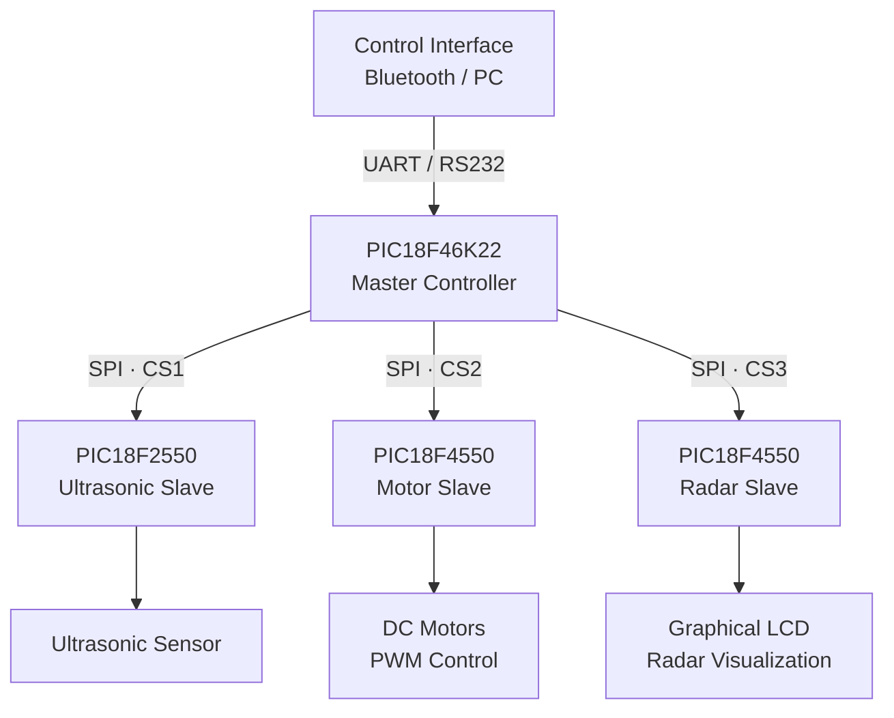

# PIC18 Distributed SCADA Mobile Robot

Academic embedded-systems project developed as part of the Microsystems course.

The project implements a distributed SCADA architecture for a mobile robot using four PIC18 microcontrollers connected through SPI. The robot receives commands through a Bluetooth/UART interface and automatically moves toward or away from an obstacle until reaching a predefined target distance.

## System Architecture

The system is divided into one master controller and three dedicated slave controllers:

- **Master controller — PIC18F46K22**
  - Receives commands through UART/RS232.
  - Operates as the SPI master.
  - Coordinates the ultrasonic, motor, and radar nodes.
  - Implements the positioning logic.

- **Ultrasonic slave — PIC18F2550**
  - Measures the distance between the robot and an obstacle using an ultrasonic sensor.
  - Uses Timer1 to measure the echo pulse duration.
  - Returns a scaled distance value to the master through SPI.

- **Motor slave — PIC18F4550**
  - Controls two DC motors.
  - Receives direction and speed commands through SPI.
  - Generates PWM signals using the CCP modules and Timer2.

- **Radar slave — PIC18F4550**
  - Receives distance information through SPI.
  - Displays the detected obstacle on a graphical LCD.
  - Implements a radar-style visualization.

## Communication



The PIC18F46K22 acts as the central controller. The three slave devices share the SPI communication architecture while each slave is selected independently through its own chip-select line.

## SPI Command Protocol

The master controller communicates with each slave using a dedicated chip-select line. Commands and data are transferred as SPI byte values.

| Command | Value | Target | Function |
|---|---:|---|---|
| `PAROO` | 0 | Motor slave | Stop the motors |
| `ULTRA` | 1 | Ultrasonic slave | Request the ultrasonic distance value |
| `MOTOR` | 2 | Motor slave | Trigger the target-position event |
| `RADAR` | 3 | Radar slave | Defined in the firmware command set |
| `FULLL` | 252 | Motor slave | Set maximum motor speed |
| `ATRAS` | 253 | Motor slave | Move backward |
| `ADELA` | 254 | Motor slave | Move forward |

Motor-speed values are also transmitted as byte values and used by the motor slave to update the PWM duty cycle.

> **Note:** Although `RADAR` is defined as a command in the master firmware, the recovered implementation directly transmits the scaled distance coordinate to the radar slave during normal operation.

### Data Flow

1. A command is received by the master controller through UART/RS232.
2. The master selects the ultrasonic slave and requests a distance value through SPI.
3. The ultrasonic slave triggers the sensor, measures the echo pulse using Timer1, and places a scaled distance value in the SPI buffer.
4. The master receives the value and converts it into the working distance used by the positioning algorithm.
5. The measured distance is compared with the selected target distance.
6. According to the position error, the master sends direction and speed commands to the motor slave.
7. A scaled distance coordinate is transmitted to the radar slave for GLCD visualization.
8. The motor slave updates motor direction and PWM duty cycle according to the received commands.

## Main Features

- Distributed architecture using four PIC18 microcontrollers
- SPI master-slave communication
- Dedicated chip-select lines for multiple SPI slaves
- Interrupt-driven SPI reception on the slave controllers
- UART/RS232 command interface
- Bluetooth-based wireless control
- Ultrasonic distance measurement
- Timer1-based echo pulse measurement
- PWM generation using CCP modules and Timer2
- Bidirectional DC motor control
- Automatic positioning at predefined target distances
- Graphical LCD radar-style visualization
- Proteus simulation project

## Project Structure

```text
pic18-distributed-scada-robot/
├── firmware/
│   ├── master/
│   │   ├── scada_master.c
│   │   └── scada_master.ccspjt
│   │
│   ├── ultrasonic_slave/
│   │   ├── scada_ultrasonic_slave.c
│   │   └── scada_ultrasonic_slave.ccspjt
│   │
│   ├── motor_slave/
│   │   ├── scada_motor_slave.c
│   │   └── scada_motor_slave.ccspjt
│   │
│   └── radar_slave/
│       ├── scada_radar_slave.c
│       └── scada_radar_slave.ccspjt
│
├── simulation/
│   └── proteus/
│       └── SCADA.pdsprj
│
├── .gitignore
└── README.md
```

## Hardware and Technologies

### Microcontrollers

- PIC18F46K22 — master controller
- PIC18F2550 — ultrasonic slave
- PIC18F4550 — motor slave
- PIC18F4550 — radar/GLCD slave

### Embedded Technologies

- C
- SPI
- UART / RS232
- Interrupts
- Timer1
- Timer2
- PWM
- CCP modules
- Ultrasonic sensing
- DC motor control
- Graphical LCD

### Development Tools

- CCS C Compiler
- Proteus Design Suite
- Git
- GitHub

## Historical Implementation Note

This repository preserves firmware originally developed for an academic project in 2023.

The source code is intentionally retained close to its original implementation so that the historical design can be reviewed before future refactoring or redesign.

One example is the ultrasonic-distance transmission. The measured value was scaled before being transferred through the byte-oriented SPI communication implemented at the time. The master subsequently converted the received value back into the distance representation used by the positioning algorithm.

A future redesign could instead define a structured communication protocol capable of transferring multi-byte measurements directly, improving range, resolution, scalability, and maintainability.

## Repository Status

The original firmware and Proteus simulation have been recovered and reorganized into a structured Git repository.

Current work focuses on:

- preserving the original implementation;
- documenting the system architecture;
- documenting the SPI communication protocol;
- improving project presentation for technical review and portfolio use.

Future revisions may include firmware refactoring, improved protocol design, hardware documentation, and additional diagrams.